# Trello Board Link
https://trello.com/b/lyNgMtuo/finance-app

# Miro Board

https://miro.com/app/board/uXjVP5DcLAI=/ 

This board contains our wireframes, colour palette choice & logo samples

# Key Features 

1. Landing page introducing application
2. register and login
3. track expenses
4. create saving pots
5. Reports 

Additional feature
1. chatbot
2. contact us

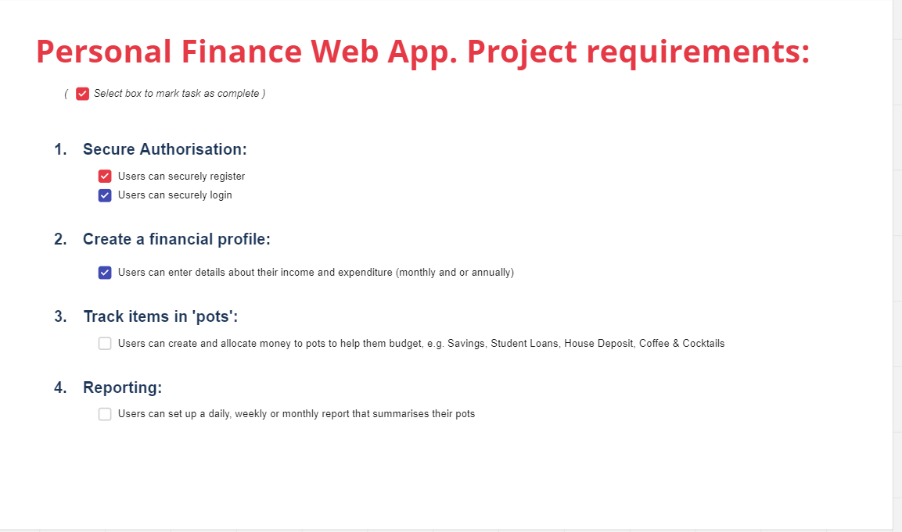

# Flow diagram 
 
 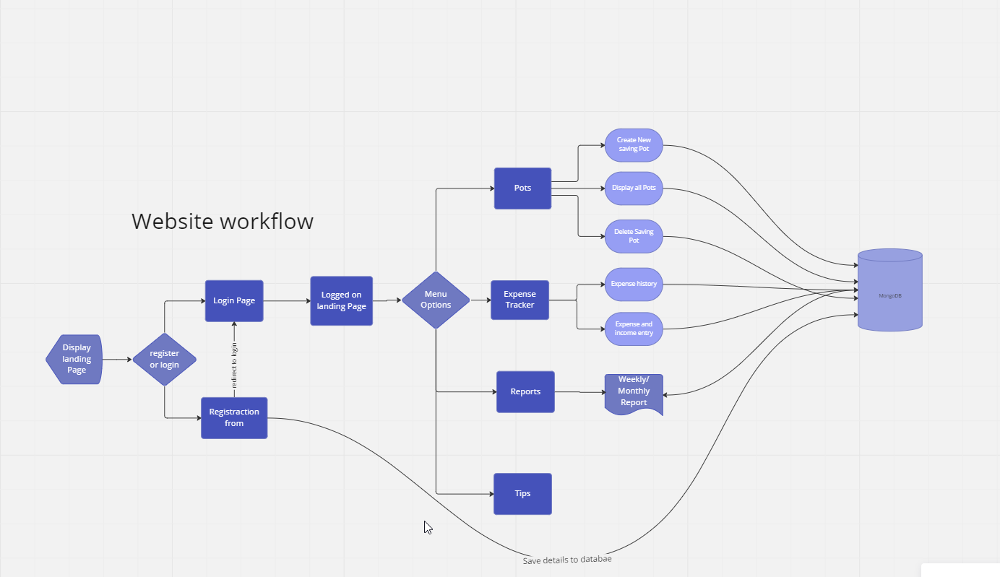

# WireFrames

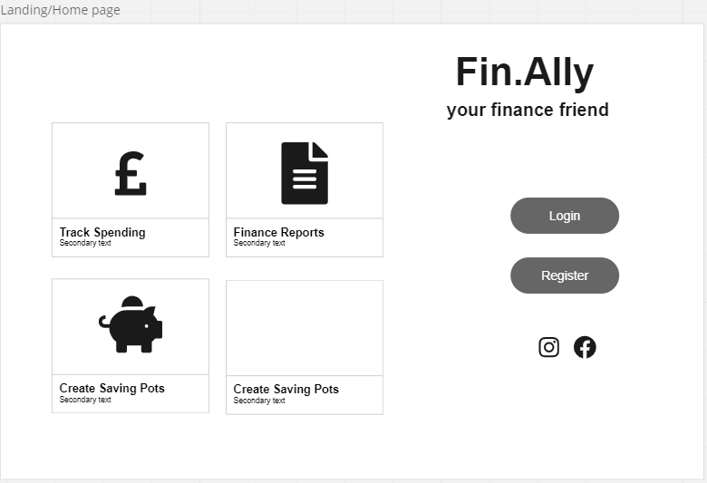

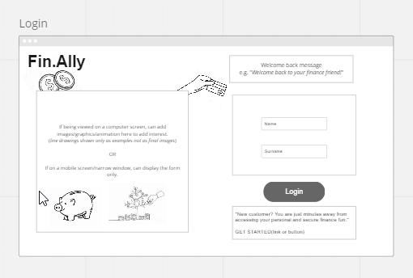

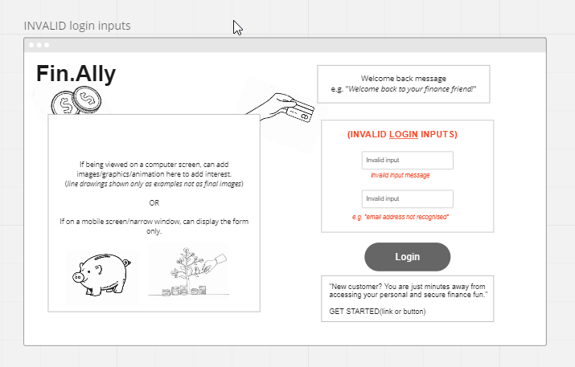

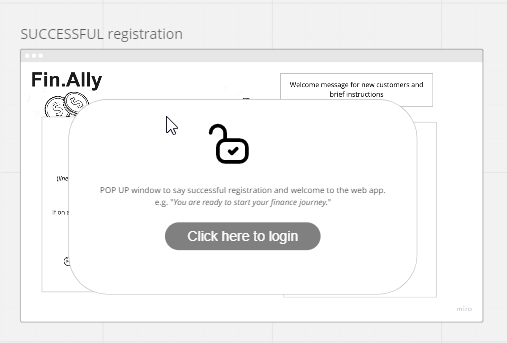

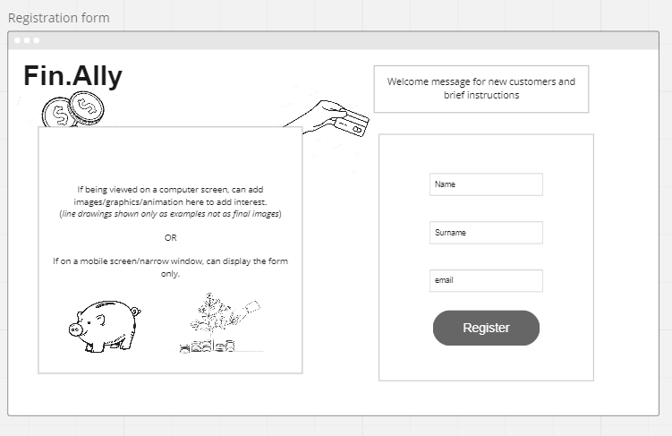

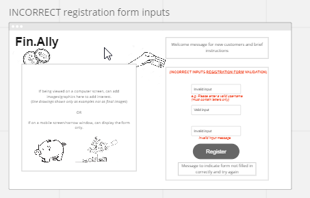

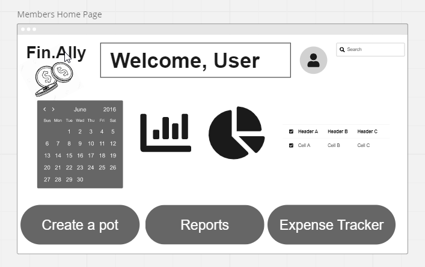

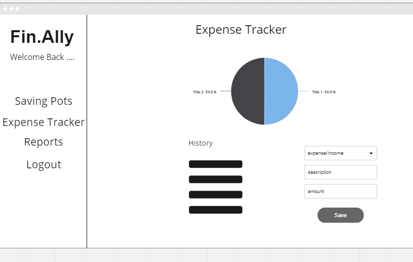

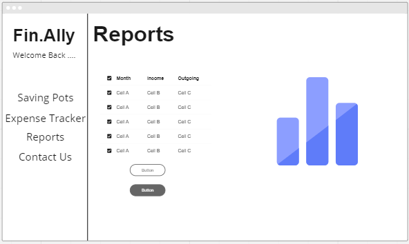

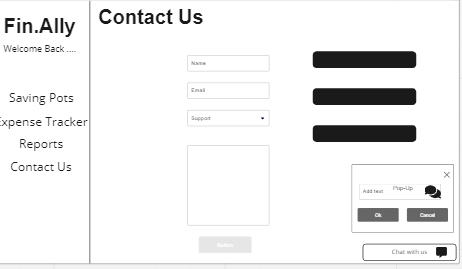

# User Stories

Landing Page:

    - As a: user browsing the web

    - I want to: Enter the url of the website

    - So that I can: read more information and potentially login/register to use it

  Acceptance Criteria/Scenario:

    - Given: I am interested in managing my Personal Finances using digital tools

    - When: I load a new Personal Finance Web Application

    - Then: I can either login if I am an existing user or register if I am a new user

Logging in existing user (Feature):

    - As a: an existing user of the web application

    - I want to: fill in my login credentials

    - So that I can: start using the application

  Acceptance Criteria/ Scenario 1 (valid credentials):

    - Given: I am on the login section

    - When: when I attempt to login with valid credentials

    - Then: I will be shown my application dashboard/homepage

  Acceptance Criteria/ Scenario 2 (invalid credentials):

    - Given: I am on the login section

    - When: when I attempt to login with invalid credentials

    - Then: I will be shown a login error message and told to try again

Navigate to registration Form:
    - As a: new user on a finance web application

    - I want to: be able to see a new user form when the page is loaded

    - So that: I can get ready to fill it in 

 Acceptance Criteria/Scenario:

    - Given: I am on the new user form

    - When: I start to interact with the form 

    - Then: I will be able to see my inputs on the form

Register new user

    - As a: new user on a finance web application

    - I want to: be able to fill in the  registration form

    - So that: I can click the submit button to complete registation

  Acceptance Criteria/Scenario 1 (filling in form correctly):

    - Given: I fill in each input field correctly

    - When: I press the “submit/complete registration” button

    - Then: I will get a message to tell me my registration was successful (validation)

  Acceptance Criteria/Scenario 2 (filling in form incorrectly):

    - Given: I fill any input field incorrectly

    - When: I press the “submit/complete registration” button

    - Then: I will get a message to tell me my registration was unsuccessful

Expense Tracker

    - As a: valid user

    - I want to: be able to enter my expenses/income 
  
    - So that I can: keep track of my expenses 

  Acceptance Criteria:

    - Given that: the user navigate to the expense tracker page 

    - When: income/expense have been entered, the entry should appear in the history section and update current balance

    - So that I can: visually keep track of my expenditure 

reports:

    - As a: Registered user of the app trying to keep track of my spending

    - I want to: be able to look at what my spending trends have been over a certain period of time

    - So that I can: look at planning my finances better for the future

  Acceptance Criteria:

    - Given that:The user is trying to look at their spend over a period of time

    - When:They got to the reporting function, they are able to access and read the data pulled from their spending habits

    - So that I can:Plan my upcoming income and expenditure

Tips: 
    - As a: App user

    - I want to: be able to get tips on how to use my money better for my family and I
    
    - So that I can: make better financial decisions 
  Acceptance Criteria:

    - Given that:The user is looking for useful tips on how to save and use money more effectively 

    - When:The tips come up they are able to be easily understood and expanded on

    - So that I can:use the information to make informed financial decisions 

